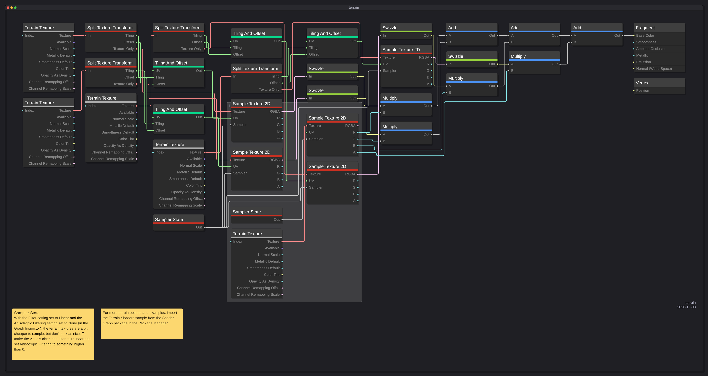
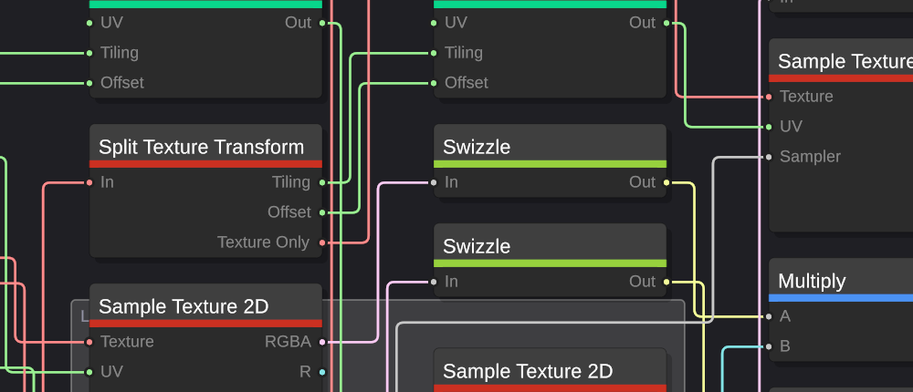

# ShaderSnap

Export a Unity Shader Graph as a clean, readable PNG.

ShaderSnap does not screenshot the Shader Graph window. It parses the `.shadergraph` asset, re-lays the
graph out deterministically, and draws it from scratch. The result is a diagram with even spacing, wires
that route around the nodes they cross, Shader Graph's own node styling, and text that stays legible
because the tool chooses the canvas size rather than inheriting whatever the editor window happened to be.



## Why not just screenshot

A screenshot captures the editor: the current zoom, the node positions the author left behind, the
selection highlight, the grid, and whatever the window size clipped. It also captures the graph at screen
resolution, so the text is as small as it looked on screen.

ShaderSnap instead produces the same image from the same asset every time, at a resolution you choose,
with the node graph laid out to be read rather than to be edited.

| | Screenshot | ShaderSnap |
|---|---|---|
| Layout | whatever the author left | deterministic, recomputed |
| Wires | overlap nodes | routed around them |
| Resolution | window size | up to 4x supersampled |
| Repeatability | depends on zoom and window | byte-identical for the same preset |
| Text size | screen size | chosen from the graph, not the window |

## Requirements

- Unity 6000.3 or newer. The exporter reaches into UI Toolkit's offscreen panel API, which is internal, so
  the supported version is stated rather than guessed.
- The `com.unity.nuget.newtonsoft-json` package, pulled in automatically as a dependency.

## Install

**From the Package Manager**

1. `Window > Package Manager`
2. `+` > `Install package from git URL…`
3. Paste `https://github.com/ZhayaGT/ShaderSnap.git`

**By editing the manifest**

Add this to `Packages/manifest.json`:

```json
{
  "dependencies": {
    "com.zhayagt.shadersnap": "https://github.com/ZhayaGT/ShaderSnap.git"
  }
}
```

**From a local checkout**

```json
{
  "dependencies": {
    "com.zhayagt.shadersnap": "file:../../ShaderSnap"
  }
}
```

## Use

1. Open `Window > ShaderSnap`.
2. Select a `.shadergraph` asset in the Project window. The graph appears in the preview and the status
   bar reports its node and edge counts.
3. Adjust the options in the left rail. The preview updates as you change them.
4. Press **Export PNG** and choose where to save.

The graph is drawn at a fixed 1x canvas size, and `Resolution Multiplier` supersamples it on top of that.
The multiplier changes how many pixels each canvas unit gets, not the layout, so raising it sharpens the
image without moving anything.

### Graphs to try first

Shader Graph ships a set of templates and samples under
`Packages/com.unity.shadergraph/GraphTemplates/` and `Samples~/`. They are real graphs of increasing size,
which makes them the quickest way to see what the tool does. Measured at the default settings:

| Graph | Nodes | Edges | 1x canvas | Max multiplier | Good for |
|---|---|---|---|---|---|
| `GraphTemplates/BuiltIn/BuiltIn Unlit Basic` | 8 | 4 | 1157 x 442 | 4x | The minimum case; one clean column run |
| `GraphTemplates/Cross Pipeline/Unlit Simple` | 10 | 4 | 1157 x 442 | 4x | Comparing against the above |
| `GraphTemplates/Cross Pipeline/0_Decal Simple` | 11 | 7 | 1413 x 442 | 4x | A short fan-out |
| `GraphTemplates/Cross Pipeline/UGUI Canvas Meter` | 14 | 12 | 1683 x 660 | 4x | A UGUI graph: one stack, not the usual two |
| `GraphTemplates/BuiltIn/BuiltIn Lit Basic` | 26 | 22 | 2041 x 1251 | 4x | The first genuinely branching graph |
| `GraphTemplates/Cross Pipeline/2_Particle Lit` | 27 | 17 | 1375 x 1248 | 4x | Groups, and a compact silhouette |
| `Samples~/FeatureExamples/Blending Masks/HeightMask` | 26 | 21 | 2102 x 1574 | 4x | Groups and sticky notes together, plus a subgraph |
| `GraphTemplates/Cross Pipeline/Terrain Simple` | 38 | 45 | 3520 x 1870 | 3x | The mid-size case: long edges, a group, two notes |
| `GraphTemplates/Cross Pipeline/1_Lit Full` | 99 | 108 | 9310 x 2061 | 1x | The stress case, and the width limit — see below |

The max multiplier column is the device's limit, not a recommendation: 2x is already sharper than any
screen shows at once. It is there because two of these graphs cannot go as high as the slider allows.

`1_Lit Full` is 9310 units wide, so it exports at 1x only: 2x would ask for 18620 pixels, past the device's
maximum texture size. It is the graph that exposed that limit, and the one to open when you want to see how
the layout handles long edges and a dense middle. `Terrain Simple` stops at 3x for the same reason.

The `Terrain Simple` template is the graph in the screenshot at the top of this page.

### Options

| Section | Option | What it does |
|---|---|---|
| Source | Preset | A saved `SnippetExportPreset` asset, so a look can be reused across graphs |
| View | Light Preview | Hides port labels in the preview so dense graphs stay responsive |
| Cables | Style | `Orthogonal` (rounded right angles), `Conduit` (45° corners), `Bezier` (smooth), `Straight` |
| | Color Mode | Per port type, one flat colour, or a gradient along the wire |
| | Width / Corner Radius / Arrow Head | Cable geometry |
| Node Style | Text Scale | Multiplies every font size. The readability control — see below |
| | Column Balance | 0 keeps the longest-path ranking; 1 evens out column heights |
| | Node Locality | How strongly a node prefers the column next to the nodes that consume it |
| | Vertical Spread | Stretches the gaps inside a column without widening the canvas |
| | Auto Aspect / Target Aspect | Solves the vertical spread to reach a canvas shape |
| | Show Node Values | Draws each node's stored value under its title |
| Readability | Group Frames | A titled frame around each group authored in Shader Graph |
| | Sticky Notes | The authored notes, in a band under the graph |
| | Highlight Critical Path | Emphasises the longest dependency chain |
| | Column Guides | Faint separators and index numbers between columns |
| | Port Legend | A legend of the port colours the graph actually uses |
| Background | Mode | Solid, gradient, transparent, or a blurred-editor backdrop |
| Frame & Watermark | Frame, shadow, corner radius, margin | The macOS-style window frame |
| | Watermark, Author, Logo | Attribution drawn into the corner |
| Export | Resolution Multiplier | 1–4x supersampling |
| | Node Warning Threshold | Warns before exporting a graph larger than this |

### Making the text larger

`Text Scale` is the control that matters, and it is the reason the default is 1.5 rather than 1.

The canvas width is set by the graph: one column per rank of the longest path, each column a node wide.
Raising the text scale therefore makes the text larger relative to that width — which is what decides how
large the graph reads once the PNG is fitted to a screen — instead of merely producing a bigger image.
Measured on the 38-node Terrain fixture, viewed fit-to-window on a 1600x900 screen:

| Text Scale | Canvas | Node title on screen | Port label on screen |
|---|---|---|---|
| 1.0 | 2934 x 1344 | 8.2 px | 6.5 px |
| 1.5 | 3520 x 1870 | 10.2 px | 8.2 px |
| 2.0 | 4339 x 2414 | 11.1 px | 8.9 px |
| 3.0 | 5976 x 3449 | 11.7 px | 9.4 px |

The canvas grows along with the text — partly in height, and partly in width, because wider fonts need
wider node boxes to avoid clipping titles. That is why the on-screen gain flattens: from 1.5 to 3.0 the
text doubles but the fitted view only improves from 10.2 px to 11.7 px. The default sits at 1.5, where the
curve is still steep.

### Node width is measured, not fixed

Shader Graph fixes its nodes at 200 px and clips whatever does not fit. In an editor that is survivable,
because the inspector still names the selected node. In an exported PNG it is not: a title cut down to
`Split Texture Tra…` is information the reader can never recover.

ShaderSnap measures the labels a graph actually contains and sizes the boxes to hold them, so titles stay
whole. Graphs with short names keep the familiar 200 px proportions.



The strip under each title is the node's category colour, and the dots on the ports are the port's data
type — both taken from Shader Graph's own stylesheets, so the output matches the editor.

## Running the tests

The package ships an EditMode suite (92 tests). Unity only compiles a package's test assembly when the
package is listed as a testable, so add it to `Packages/manifest.json` first:

```json
{
  "testables": [
    "com.zhayagt.shadersnap"
  ]
}
```

Then open `Window > General > Test Runner`, choose **EditMode**, and run.

Two notes on the suite:

- The export tests render an offscreen UI Toolkit panel and read the pixels back, so they need a graphics
  device. They skip themselves with a clear message when none is present, which is what happens under
  `-batchmode -nographics` on a CI runner.
- The determinism tests compare PNG bytes. That is meaningful on one machine; across GPU drivers,
  rasterisation can differ by a pixel or two, so the byte comparison is not a cross-platform guarantee.

`Tests/Reference~/TerrainSimple_1x.png` is a committed baseline for eyeballing the output. Nothing asserts
against it, and it is not a byte comparison — it exists so a change to the drawing can be reviewed by
looking at two images side by side. Regenerate it after an intentional change to the defaults:

1. Open the project the package is installed into.
2. Select `Tests/Fixtures~/TerrainSimple.shadergraph` in the ShaderSnap window.
3. Set `Resolution Multiplier` to 1 and leave every other option at its default.
4. Export over `Tests/Reference~/TerrainSimple_1x.png`.

## Troubleshooting

**The window opens unstyled.** The stylesheet failed to load. The console will carry a
`[ShaderSnap] Could not load the editor stylesheet` error naming the path it tried. This means the package
registry and the files on disk disagree; reimporting the package usually clears it.

**"The UI Toolkit panel rendering API is unavailable on this Unity version".** The exporter reflects into
`PanelSettings.panel` and four methods on the internal `Panel` type. Unity renamed or removed one of them.
The message names which one. ShaderSnap is built and tested against Unity 6000.3.

**The export is slow on a large graph.** Cost grows with node count and multiplier. Measured on this
machine: the 38-node Terrain graph at 4x takes about 5 s, and the 99-node reference graph at 1x about 1.2 s.
Lower the multiplier, or turn off `Show Node Values` and `Highlight Critical Path`, both of which add work
per node. Note that a graph wide enough will not accept a high multiplier at all — see the next entry.

**"Resolution … exceeds the memory budget" or "exceeds this device's … maximum texture size".** Two limits,
both checked before anything is allocated. The **maximum texture size** is the device's ceiling on any
texture edge (`SystemInfo.maxTextureSize`, commonly 16384); a wide graph hits it first, because the 99-node
reference graph is 9310 units wide and a 2x export would ask for 18620 pixels. The **memory budget** is
96 MiB, about 100 million pixels. Either way, lower `Resolution Multiplier`.

## How it works

See [Documentation~/index.md](Documentation~/index.md) for the architecture, the layout algorithm, the
exporter internals, and the reasoning behind the deviations from a naive implementation.

## License

MIT. See [LICENSE.md](LICENSE.md).
